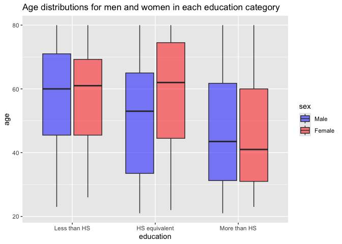

p8105_hw3_zc2822
================
Zhengyong Chen

## Problem 2

Load, tidy, merge, and organize the data sets.

``` r
demo_df = 
  read_csv("data/nhanes_covar.csv", na = c("NA", ".", ""), skip = 4) |> 
  janitor::clean_names() |> 
  filter(age >= 21, 
         !is.na(sex), !is.na(age), !is.na(bmi), !is.na(education)) |> 
  mutate(
    sex = factor(sex, levels = c(1, 2), labels = c("Male", "Female"), ordered = TRUE),
    education = factor(education, levels = c(1, 2, 3), 
                       labels = c("Less than HS", "HS equivalent", "More than HS"), 
                       ordered = TRUE)
  )

accel_df = 
  read_csv("data/nhanes_accel.csv", na = c("NA", ".", "")) |> 
  janitor::clean_names()

mims_df <- left_join(demo_df, accel_df, by = "seqn")
```

Table for the number of men and women in each education category.

``` r
demo_df |> 
  group_by(education, sex) |> 
  summarise(count = n()) |> 
  pivot_wider(
    names_from = sex,
    values_from = count
  ) |> 
  knitr::kable()
```

| education     | Male | Female |
|:--------------|-----:|-------:|
| Less than HS  |   27 |     28 |
| HS equivalent |   35 |     23 |
| More than HS  |   56 |     59 |

Visualization of the age distributions for men and women in each
education category.

``` r
demo_df |> 
  group_by(education, sex) |> 
  ggplot(aes(x = education, y = age, color = sex)) +
  geom_boxplot() +
  labs(title = "Age distributions for men and women in each education category")
```

<!-- -->

Comment:

The younger age group (\<40) of female tends to have a more than high
school education, and that of male tends to have a high school
equivalent and more than high school education.

For the less than high school education category, the age spread of male
and female does not differ much, with medians around 60, which is a
little bit larger in female group, but the largest age in male group is
larger than that in female group.

For the high school equivalent education category, from both the age
spread and the median, male tends to be younger than female.

For the more than high school education category, the age spread of male
and female does not differ much, but the female group has a smaller
median.
